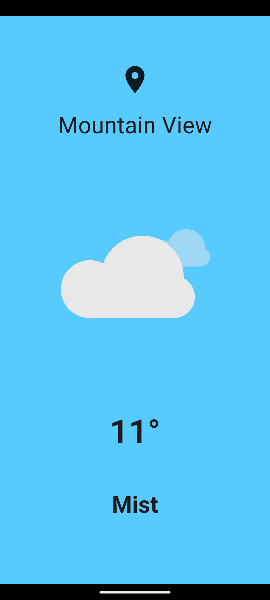
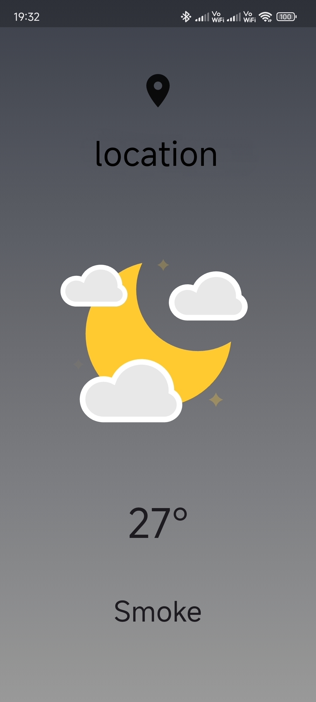

# 🌤 SkyCast — Flutter Weather App

SkyCast is a beautiful Flutter weather application that shows real-time weather based on your **current location**.  
It features smooth animations, dynamic backgrounds, and a clean UI.

> Inspired by this tutorial: https://youtu.be/yLtpMqvMgdY

---

## ✨ Features

✅ Detects your **current city automatically**  
✅ Fetches **live weather data** from OpenWeatherMap  
✅ Displays:

- 🌡 Temperature (°C)
- 📍 City Name
- 🌥 Weather Condition
- 🎞 Animated weather illustrations (Lottie)

✅ Background color changes based on weather  
✅ Clean and modern UI  
✅ Works on Android devices  

---

## 📱 Screenshots

<p align="center">
  <table>
    <tr>
      <td align="center">
        
      </td>
      <td align="center">
        
      </td>
    </tr>
  </table>
</p>

## 🛠 Built With

- **Flutter**
- **Dart**
- **OpenWeatherMap API**
- **Geolocator** (for location)
- **Geocoding** (to convert location → city)
- **Lottie** (for animations)

---

## 📦 Packages Used

```yaml
http
geolocator
geocoding
lottie
flutter_launcher_icons
